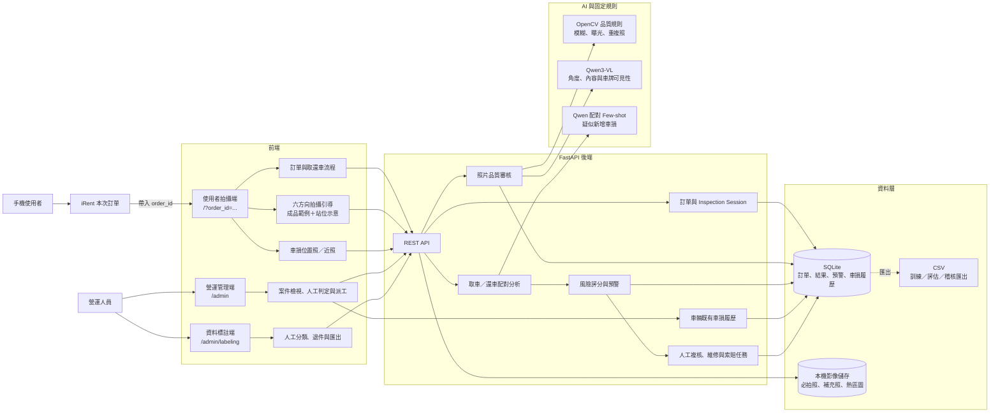
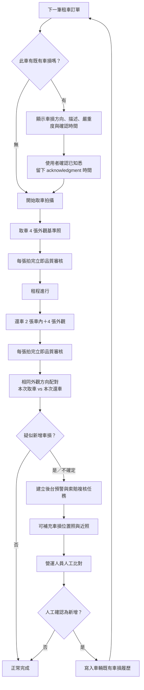

# Carma 目前成果架構圖

更新日期：2026-08-21

## 1. 系統元件架構

## 2. 取還車與跨租程車損履歷

## 3. 目前已完成

- iRent 訂單頁帶入 `order_id`，使用者端唯讀顯示訂單與車牌並自動判斷取／還車階段。
- 手機版取車 4 張、還車 6 張逐步拍攝；缺少同訂單完整取車基準時，後端禁止建立或分析還車流程。
- 使用者拍攝端與營運／標註管理端使用獨立網址及導覽，使用者頁面不提供後台入口。
- 六方向成品範例與拍攝站位示意。
- 拍完立即執行 Qwen3-VL＋固定 CV 品質審核。
- 四組外觀取還車照片配對 Few-shot 車損分析。
- 車損異常預警、營運案件、人工複核及派工。
- 六方向以外的車損位置照與近照上傳。
- 人工確認後建立車輛既有車損履歷。
- 下一位使用者取車前必須確認既有車損。
- 完整後端測試目前共 49 項，全部通過。

## 4. 目前限制

- 車損近照目前提供給營運人員蒐證，尚未送入 Qwen 做第二階段判斷。
- 既有車損目前以方向、描述及人工紀錄為主，尚未做到鈑件座標級比對。
- 車內整潔度分析尚未正式啟用，現階段以外觀新車損為主。
- AI 只產生疑似預警，不應直接作為自動索賠依據。
- SQLite 與本機影像儲存適合目前 MVP；正式上線需改為集中式資料庫與物件儲存。

## 5. 建議下一階段

1. 為每筆既有車損建立指定位置確認照與鈑件區域。
2. 將補充近照加入第二階段多圖 VLM 判斷。
3. 建立車損狀態：`active / repaired / disputed / resolved`。
4. 加入車內髒污人工標註資料，再啟用三分類模型。
5. 將 SQLite／本機檔案升級為正式資料庫、物件儲存與通知服務。

## 6. 判定原則

CSV 不是正式車損紀錄來源。正式資料以資料庫中的訂單、照片時間、人工判定及車損履歷為準；CSV 僅由資料庫匯出，用於模型訓練、評估或稽核。
